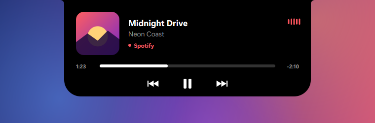

<div align="center">

# NotchIsland

**L'encoche du MacBook et la Dynamic Island de l'iPhone, sur Windows.**

Une encoche noire vit en haut de ton écran, s'anime quand tu écoutes de la musique,
affiche le volume, le morceau suivant, et se transforme en mini-lecteur quand tu passes la souris dessus.


[](#installation)
[](#lancer-depuis-le-code-source)
[-41CD52?logo=qt&logoColor=white)](https://doc.qt.io/qtforpython-6/)
[](LICENSE)

[**⬇ Télécharger NotchIsland.exe**](https://github.com/VaticUI/NotchIsland/releases/latest)

</div>

---

## Sommaire

- [Fonctionnalités](#fonctionnalités)
- [Aperçu des états](#aperçu-des-états)
- [Installation](#installation)
- [Utilisation](#utilisation)
- [Applications compatibles](#applications-compatibles)
- [Lancer depuis le code source](#lancer-depuis-le-code-source)
- [Compiler l'exécutable](#compiler-lexécutable)
- [Comment ça marche](#comment-ça-marche)
- [Personnalisation](#personnalisation)
- [Limites connues](#limites-connues)
- [Licence](#licence)

## Fonctionnalités

- 🎵 **Réagit à la musique** : dès qu'un morceau joue, l'encoche s'élargit avec la pochette et un égaliseur animé.
- 📈 **Égaliseur branché sur le vrai son** : les barres suivent le niveau sonore réel du PC, pas une animation en boucle.
- 🎨 **Couleurs de la pochette** : l'égaliseur et le nom de l'appli prennent la couleur dominante de l'album.
- 🔔 **Aperçu au changement de morceau** : titre, artiste et pochette s'affichent quelques secondes.
- 🔊 **Indicateur de volume** : l'encoche montre le niveau du volume quand tu le modifies (et le mode muet).
- 🖱️ **Lecteur complet au survol** : pochette, titre défilant, source, barre de progression cliquable, précédent / lecture / suivant.
- 🕒 **Horloge** : sans musique, le survol affiche l'heure et la date.
- 🪄 **Animations à ressort** : rebond léger dans l'esprit des animations d'Apple.
- 🫥 **Discrète** : pas de fenêtre dans la barre des tâches, ne vole jamais le focus, les clics à côté de l'encoche passent au travers.
- 🚀 **Démarrage automatique** en option, depuis l'icône de la zone de notification.

## Aperçu des états

| État | Aperçu |
|---|---|
| **Repos** : l'encoche noire, simplement |  |
| **Musique en cours** : pochette + égaliseur |  |
| **Nouveau morceau** : aperçu pendant ~3 s |  |
| **Volume** : quand tu montes ou baisses le son |  |
| **Survol** : le lecteur complet |  |
| **Survol sans musique** : heure et date |  |

## Installation

### Option 1 : l'exécutable (le plus simple)

1. Télécharge **`NotchIsland.exe`** depuis la page [Releases](https://github.com/VaticUI/NotchIsland/releases/latest).
2. Double-clique dessus. C'est tout, rien à installer.

> Windows SmartScreen peut afficher un avertissement car l'exécutable n'est pas signé :
> clique sur **Informations complémentaires → Exécuter quand même**.

### Option 2 : depuis le code source

Voir [Lancer depuis le code source](#lancer-depuis-le-code-source).

## Utilisation

| Action | Résultat |
|---|---|
| Lancer une musique (Spotify, YouTube…) | L'encoche s'élargit avec la pochette et l'égaliseur |
| Passer la souris sur l'encoche | Le lecteur complet s'ouvre |
| Cliquer sur ⏮ ⏯ ⏭ | Morceau précédent / lecture-pause / suivant |
| Cliquer sur la barre de progression | Avance ou recule dans le morceau |
| Changer le volume | L'encoche affiche le niveau du volume |
| Clic droit sur l'icône près de l'horloge | **Lancer au démarrage de Windows** / **Quitter** |

Une seule instance peut tourner à la fois : relancer le programme ne crée pas une deuxième encoche.

## Applications compatibles

NotchIsland lit les informations exposées par Windows à ses propres contrôles média
(ceux qui apparaissent quand tu appuies sur les touches de volume). Tout ce qui s'y affiche fonctionne, par exemple :

- Spotify, Deezer, Apple Music, Tidal
- YouTube, YouTube Music, SoundCloud, Twitch… dans **Chrome**, **Edge**, **Firefox**, **Brave**, **Opera**
- Lecteur multimédia Windows, VLC (versions récentes), et bien d'autres

S'il y a plusieurs sources, l'encoche choisit celle qui **est en train de jouer**.

## Lancer depuis le code source

Prérequis : **Windows 10 ou 11** et **Python 3.10+**.

```bash
git clone https://github.com/VaticUI/NotchIsland.git
```

```bash
cd NotchIsland
```

```bash
python -m venv .venv
```

```bash
.venv\Scripts\pip install -r requirements.txt
```

```bash
.venv\Scripts\pythonw notch.py
```

Utilise `python` au lieu de `pythonw` pour voir les messages d'erreur dans la console.

## Compiler l'exécutable

```bash
.venv\Scripts\pip install pyinstaller
```

```bash
.venv\Scripts\pyinstaller --noconfirm --onefile --windowed --name NotchIsland --collect-submodules winrt --collect-submodules comtypes notch.py
```

L'exécutable est créé dans `dist\NotchIsland.exe`.

## Comment ça marche

```
┌─────────────────────────┐   signaux Qt   ┌────────────────────────────┐
│ MediaWorker (thread)    │ ─────────────▶ │ Notch (fenêtre Qt, 60 i/s) │
│ asyncio + WinRT         │                │ ressorts + dessin QPainter │
│ titre, artiste, pochette│ ◀───────────── │ clics lecteur + recherche  │
│ position, contrôles     │   commandes    └─────────────┬──────────────┘
└─────────────────────────┘                              │
                                            ┌────────────▼─────────────┐
                                            │ AudioProbe (pycaw/WASAPI)│
                                            │ niveau sonore + volume   │
                                            └──────────────────────────┘
```

- **Infos média** : l'API Windows `GlobalSystemMediaTransportControlsSessionManager`
  (via [PyWinRT](https://github.com/pywinrt/pywinrt)) donne le titre, l'artiste, la pochette, la position et
  permet de piloter la lecture. Elle est interrogée toutes les 350 ms dans un thread séparé.
- **Son** : [pycaw](https://github.com/AndreMiras/pycaw) lit le niveau de crête de la sortie audio (`IAudioMeterInformation`)
  pour animer l'égaliseur, et le volume maître (`IAudioEndpointVolume`) pour l'indicateur de volume.
- **Rendu** : une fenêtre Qt transparente, sans bordure, toujours au premier plan. La forme de l'encoche
  (avec ses petits raccords concaves au bord de l'écran) est dessinée en courbes de Bézier. Sa largeur, sa hauteur
  et ses coins sont animés par des ressorts légèrement sous-amortis, d'où le rebond.
- **Clics** : un masque de fenêtre suit la forme de l'encoche, donc tout ce qui est à côté reste cliquable normalement.

## Personnalisation

Tout se règle en haut de [`notch.py`](notch.py) :

```python
SIZES = {
    "idle": (200, 32, 10),       # (largeur, hauteur, rayon des coins)
    "compact": (300, 32, 12),
    "volume": (320, 32, 12),
    "peek": (420, 78, 26),
    "expanded": (500, 196, 34),
}
EAR = 8   # taille des raccords concaves avec le bord de l'écran
```

La raideur et l'amortissement des animations sont dans la classe `Spring` (`k` et `d`).

## Limites connues

- L'indicateur de volume de Windows s'affiche toujours en plus de celui de l'encoche.
- L'égaliseur suit **tout** le son du PC (notifications, jeux…), pas uniquement la musique.
- L'encoche s'affiche sur l'écran **principal** seulement.
- Certaines applis ne partagent ni la pochette ni la position de lecture : l'encoche affiche alors une pochette par défaut
  et masque la barre de progression.

## Licence

[MIT](LICENSE). Libre à toi de l'utiliser, la modifier et la partager.

*Projet non affilié à Apple. « MacBook », « iPhone » et « Dynamic Island » sont des marques d'Apple Inc.*
